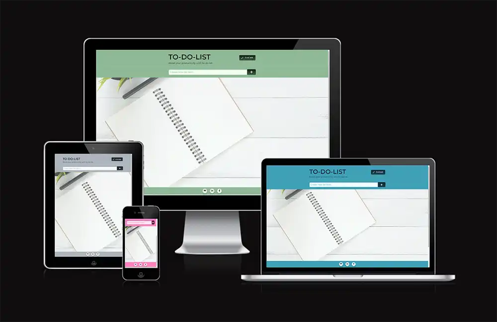
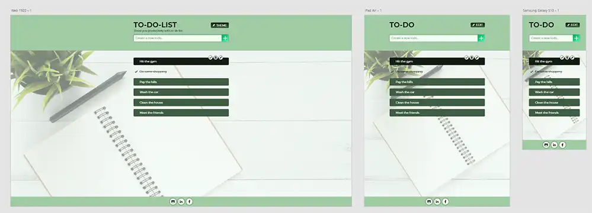
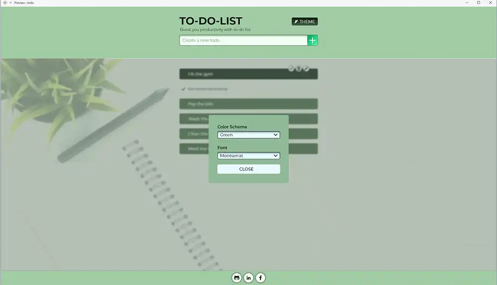
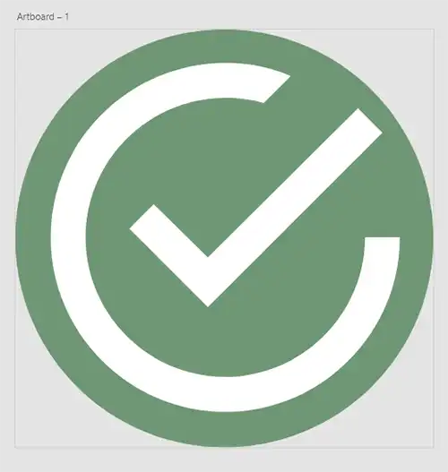
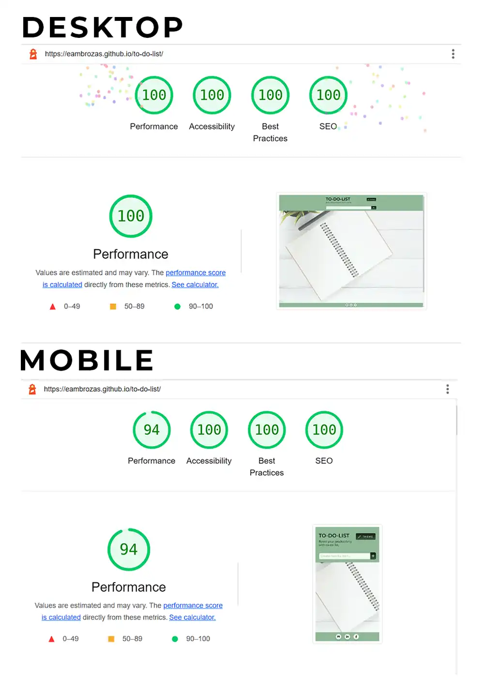
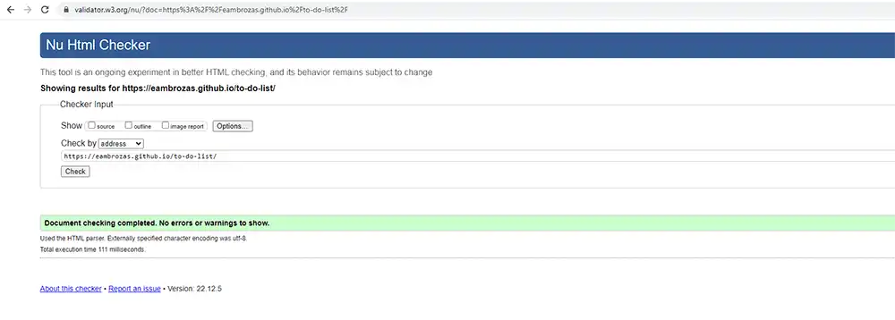
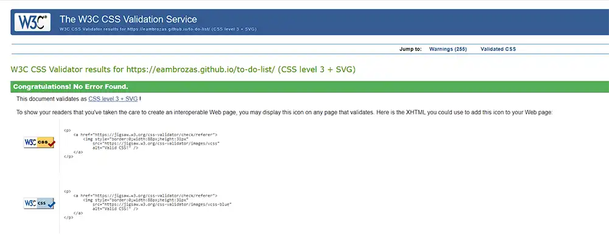
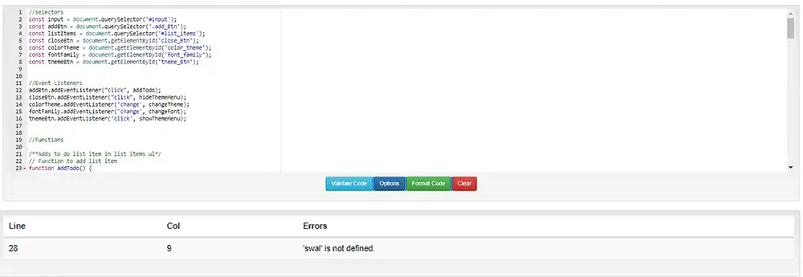

<h1>To Do List | PORTFOLIO PROJECT 2</h1>

The second project for Code Institute is To Do List. The website is made to be responsive, enabling users to read and interact with it on various device types and sizes. The website's goal is to assist users in organizing the daily tasks that must be completed.

<a href="https://eambrozas.github.io/to-do-list/" target="_blank">View live website here.</a>

<h2>Table of Contents</h2>

- [User Experience (UX)](#ux)
    - [User stories](#user-stories)
        - [First Time Visitors Goals](#first-time)
        - [Returning Visitors Goals](#returning)
    - [Features](#features)
    - [Design](#design)
        - [Typography](#typography)
        - [Adobe XD Design](#adobe-design)
            - [Main page design](#main-design)
            - [Theme menu design](#theme-design)
            - [Favicon design](#favicon-design)
- [Technologies](#technologies)
    - [Languages Used](#languages)
    - [Frameworks, Libraries & Programs Used](#flp)
- [Testing](#testing)
    - [Lighthouse](#lighthouse)
    - [HTML Validation](#html)
    - [CSS Validation](#css)
    - [JS Validation](#js)
    - [Further Testing](#further-testing)
- [Deployment](#deployment)
    - [Project Creation](#project-creation)
    - [Start Project in Gitpod](#start-project)
    - [Run Project Live Preview](#live-preview)
    - [GitHub Pages](#github-pages)
    - [Git commands](#git-commands)
- [Credits](#credits)
   
   
<h2 id="ux">User Experience (UX)</h2>

<h3 id="user-stories">User Stories</h3>

<ul>
    <li id="first-time">First Time Visitors Goals
        <ul>
            <li>As a First time visitor, I want to be able to easily comprehend the website's main goal.</li>
            <li>As a First Time Visitor, I want to be able to discover content on the site with ease.</li>
        </ul>
    </li>
</ul>
<ul>
    <li id="returning">Returning Visitors Goals
        <ul>
            <li>As a Returning Visitor, I want to be able to easily make a to-do list.</li>
            <li>As a Returning Visitor, I need the ability to modify each to-do list.</li>
            <li>As a Returning Visitor, I want to have the option to modify the color scheme to something I prefer.</li>
        </ul>    
    </li>
</ul>

<h3 id="features">Features</h3>

>As a First time visitor, I want to be able to easily comprehend the website's main goal.
<ul>
    <li>The website's primary headline is "To Do List," and the content that follows provides further details regarding the to-do list.</li>
    <li>The inputs placeholder prompts the user to add a new item to the list.</li>
    <li>A diary and pen are shown in the website's primary background picture to signify that it is meant to be a notebook.</li>
</ul> 

>As a First Time Visitor, I want to be able to discover content on the site with ease.
<ul>
    <li>The website's content and features are aesthetically displayed within the device's view port size.</li>
    <li>To avoid having to scroll up each time a user wants to add a new list item, the input for generating list items has a position of sticky at the top.</li>
</ul> 

>As a Returning Visitor, I want to be able to easily make a to-do list.
<ul>
    <li>The inputs placeholder invites the user to add to the list by entering a new item.</li>
    <li>There are only two steps required to generate a list item. Enter some text in the input field and then click the + sign-shaped add icon to the right of the field.</li>
    <li>The user will be informed with an alert if the input is empty.</li>
</ul> 

>As a Returning Visitor, I need the ability to modify each to-do list.
<ul>
    <li>An edit, remove, and check button will be present next to each item on the to-do list.</li>
    <li>By using the check button, the user may mark completed to-do items and change their appearance.</li>
    <li>The to do item can be taken off the list using the remove button.</li>
    <li>The user can retype their task by clicking the Edit button.</li>
</ul> 

>As a Returning Visitor, I want to have the option to modify the color scheme to something I prefer.
<ul>
    <li>The user is given access to a theme button that, when pressed, brings up a popup menu with choices for customizing the font style and color scheme.</li>
</ul> 

<h3 id="design">Design</h3>
<ul>
    <li id="typography">Typography
        <ul>
            <li>All text elements on the page use the Montserrat font, making the content simple to read. If the primary font cannot load for any reason, sans-serif is applied as a backup. Additionally, the user is provided with two other options to choose from and change  between Poppins and Oswald as these are provided in the themes menu.</li>
        </ul>
    </li>
    <li id="color">Colour Scheme
        <ul>
            <li>The primary colour for the application is various hues of green. The user is given an additional 3 alternatives to select from themes menu, including various blue, grey, and pink hues, to adjust the colour scheme they desire.</li>
        </ul>
    </li>
    <li id="imagery"> Imagery
        <ul>
            <li>I chose a picture of a pen and paper to signify a diary and to tie in with the overall application design.</li>
        </ul>
    </li>
</ul>

<h3 id="adobe-design">Adobe XD Design</h3>
<h4 id="main-design">Main page design</h4>

<h4 id="theme-design">Theme menu design</h4>

<h4 id="favicon-design">Favicon design</h4>

<h2 id="technologies">Technologies</h2>

<h3 id="languages">Languages Used</h3>
<ul>
    <li><a href="https://en.wikipedia.org/wiki/HTML">HTML5</a></li>
    <li><a href="https://en.wikipedia.org/wiki/CSS">CSS3</a></li>
    <li><a href="https://en.wikipedia.org/wiki/JavaScript">JavaScript</a></li>
</ul>

<h2 id="flp">Frameworks, Libraries & Programs Used</h2>

<ul>
    <li><a href="https://fonts.google.com/">Google Fonts</a>
        <ul>
            <li>Google fonts were used to import the 'Roboto Serif' font into the style.css file which is used on all text elements.</li>
        </ul>
    </li>
</ul>
<ul>
    <li><a href="https://fontawesome.com/">Font Awesome</a>
        <ul>
            <li>Font Awesome was used for social links and google review button.</li>
        </ul>
    </li>
</ul>
<ul>
    <li><a href="https://git-scm.com/">Git</a>
        <ul>
            <li>Git was used for version control by utilizing the Gitpod terminal to commit to Git and Push to GitHub.</li>
        </ul>
    </li>
</ul>
<ul>
    <li><a href="https://github.com/">GitHub</a>
        <ul>
            <li>GitHub was used to store the projects code after being pushed from Git.</li>
        </ul>
    </li>
</ul>
<ul>
    <li><a href="https://www.adobe.com/ie/products/photoshop-lightroom.html?gclid=Cj0KCQjwnvOaBhDTARIsAJf8eVOjH4dPSEF5YUvt-cy_GQOAe-YZNeQC-b-f9an8MbE2ZYIu9-4XgyEaAsQaEALw_wcB&mv=search&mv=search&sdid=L7NVTQ8Y&ef_id=Cj0KCQjwnvOaBhDTARIsAJf8eVOjH4dPSEF5YUvt-cy_GQOAe-YZNeQC-b-f9an8MbE2ZYIu9-4XgyEaAsQaEALw_wcB:G:s&s_kwcid=AL!3085!3!547896439650!e!!g!!adobe%20lightroom!1423511177!58810487274">Adobe Lightroom</a>
        <ul>
            <li>Adobe Lightroom was used to add color preset for all photos.</li>
        </ul>
    </li>
</ul>
<ul>
    <li><a href="https://www.adobe.com/ie/products/photoshop.html?gclid=Cj0KCQjwnvOaBhDTARIsAJf8eVO3rRHxJnLt7dFLsz9rBsMrQoVGoDK5svXE0qzu0eMgLEzLGhT-dPgaAofzEALw_wcB&mv=search&mv=search&sdid=LZ32SYVR&ef_id=Cj0KCQjwnvOaBhDTARIsAJf8eVO3rRHxJnLt7dFLsz9rBsMrQoVGoDK5svXE0qzu0eMgLEzLGhT-dPgaAofzEALw_wcB:G:s&s_kwcid=AL!3085!3!441704131147!e!!g!!adobe%20photoshop!1423511192!58810496314">Adobe Photoshop</a>
        <ul>
            <li>Adobe Photoshop was used to resize all the images.</li>
        </ul>
    </li>
</ul>
<ul>
    <li><a href="https://www.adobe.com/uk/products/xd.html">Adobe XD</a>
        <ul>
            <li>Adobe XD was used to create the prototype of the website.</li>
        </ul>
    </li>
</ul>
<ul>
    <li><a href="https://www.gitpod.io/">Gitpod</a>
        <ul>
            <li>Gitpod was used to develop the website.</li>
        </ul>
    </li>
</ul>
<ul>
    <li><a href="https://sweetalert2.github.io/">Sweet alert</a>
        <ul>
            <li>Sweet Alert was used to inform the user that the input is empty while adding a list item with an empty input.</li>
        </ul>
    </li>
</ul>

<h2 id="testing">Testing</h2>

<h3 id="lighthouse">Lighthouse</h3>

<h3 id="html">HTML Validation</h3>

<h3 id="css">CSS Validation</h3>

<h3 id="js">JS Validation</h3>

<h3 id="further-testing">Further Testing</h3>
<ul>
    <li>Responsiveness was tested using <a href="https://ui.dev/amiresponsive?url=https://eambrozas.github.io/to-do-list/">ui.dev</a></li>
    <li>The Website was tested on Google Chrome, Microsoft Edge and Firefox browsers.</li>
    <li>The website was viewed on a variety of devices such as Desktop, Laptop, Samsung Galaxy s9, Galaxy a13, Galaxy a50s.</li>
    <li>Every link on the website was testes that it is linked correctly.</li>
    <li>User Experience issues were tested by friends, family and slack community.</li>
    <li>Lighthouse report was generated for the website.</li>
    <li>HTML was checked by Markup Validation Service.</li>
    <li>CSS was checked by CSS Validation Service.</li>
    <li>JavaScript validator was used to validate JavaScript.</li>
    <li>Console log was used throughout the building process to check if there were any errors.</li>
</ul>

<h2 id="deployment">Deployment</h2>

<h3 id="project-creation">Project Creation</h3>
<ul>
    <li>
    I used <a href="https://github.com/Code-Institute-Org/gitpod-full-template">Code Institute Template</a> to start the project by clicking on a 'Use this template' dropdown menu and selecting 'Create a new repository'. I gave it a repository name 'to-do-list', checked the Include all branches checkbox and clicked on a green button called 'Create repository from template' to create repository.
    </li>
</ul>

<h3 id="start-project">Start Project in Gitpod</h3>
<ol>
    <li>Navigate to the Github <a href="https://github.com/EAmbrozas/to-do-list">repository</a>.</li>
    <li>Clik green 'Gitpod' button.</li>
</ol>

<h3 id="live-preview">Run Project Live Preview</h3>
<ol>
    <li>Open the project in Gitpod.</li>
    <li>Add 'python3 -m http.server' command in terminal.</li>
    <li>Click 'open preview' button to view the project with in Gitpod text editor or click 'open browser' button to view project in browser.</li>
</ol>

<h3 id="github-pages">GitHub Pages</h3>
<ol>
    <li>Navigate to <a href="https://github.com/EAmbrozas/to-do-list">GitHub</a> repository.</li>
    <li>Go to Settings > Pages.</li>
    <li>Select main branche as the source.</li>
    <li>Click 'save' button.</li>
    <li>Click the 'Visit site' button to open up deployed website.</li>
</ol>

<h3 id="git-commands">Git commands</h3>
<ul>
    <li>git status - displays the state of the working directory and the staging area.</li>
    <li>git add . - adds a change in the working directory to the staging area.</li>
    <li>git commit -m "Commit message" - used to save changes to the local repository.</li>
    <li>git push - upload local repository content to a remote repository.</li>
</ul>

<h2 id="credits">Credits</h2>